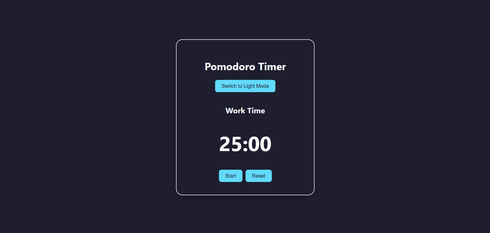

# Pomodoro Timer ⏱️

A simple and elegant Pomodoro Timer built using **React**, with light/dark theme support, clean layout, and essential timer controls.

## 🚀 Features

- ⏲️ 25-minute work sessions + 5-minute breaks
- 🎛️ Start, Pause, and Reset buttons
- 🌓 Toggle between Light and Dark theme
- 🧠 Focus-enhancing UI with minimal distractions
- ⚛️ Built with React and modern hooks (`useState`, `useEffect`)

---

## 📸 Preview

  
> Screenshot of the dark mode UI 

---

## 🛠️ Installation

```bash
git clone https://github.com/yourusername/pomodoro-timer.git
cd pomodoro-timer
npm install
npm start
